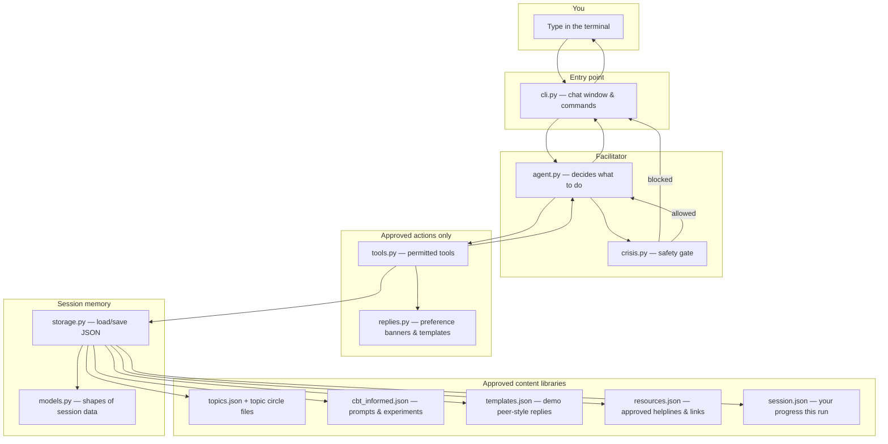
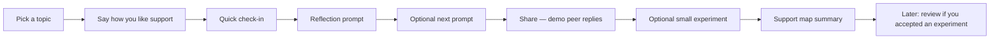

# Agentic CLI Demo

**Deadline:** 25 August 2026

This is the **working demo** of Small Circles today: a chat in your terminal that guides one person through a short, structured support session.

It is **not** therapy, not a crisis service, and **not** a live group of real people yet. Peer replies in this demo are clearly labeled **templates** (stand-ins) until a later product stage adds real human circles.

For the full long-term product vision, see [README.md](../README.md).  
For how research shaped the prompts, see [cbt-informed-research.md](cbt-informed-research.md).

---

## In one sentence

You type in the terminal → a **safety check** runs → a **facilitator** (AI or simple demo brain) may call **approved tools** → those tools only read/write **approved content files** → you see a short reply (and optional tool traces).

---

## Architecture (what happens when you send a message)



**Plain reading of the diagram**

1. **You** talk to the terminal ([`src/cli.py`](../src/cli.py)).
2. The **facilitator** ([`src/agent.py`](../src/agent.py)) receives your message.
3. A **safety gate** ([`src/crisis.py`](../src/crisis.py)) can stop normal help for crisis language, diagnosis asks, or medication asks — and show approved Singapore resources instead.
4. If allowed, the facilitator may call **tools** ([`src/tools.py`](../src/tools.py)) — small, explicit actions like “get a reflection prompt” or “suggest an experiment.” It cannot invent clinical worksheets or hotlines.
5. Tools pull from **approved content** under [`data/`](../data/) and save progress to [`data/session.json`](../data/session.json) via [`src/storage.py`](../src/storage.py) / [`src/models.py`](../src/models.py).
6. You get a short answer back. In live mode the wording is polished by OpenAI; the **substance** still comes from those libraries.

---

## Map of every important file

### Software (how it runs)

| Piece | Role in plain language | File |
|---|---|---|
| Chat window | Starts the demo, shows `/help`, prints replies | [`src/cli.py`](../src/cli.py) |
| Facilitator | Chooses next step (live AI or offline mock planner) | [`src/agent.py`](../src/agent.py) |
| Safety gate | Stops unsafe topics; shows approved crisis copy | [`src/crisis.py`](../src/crisis.py) |
| Tools | The only actions the facilitator is allowed to take | [`src/tools.py`](../src/tools.py) |
| Peer-style wording | Builds preference banners and fills reply templates | [`src/replies.py`](../src/replies.py) |
| Session shapes | Defines what a “session” remembers | [`src/models.py`](../src/models.py) |
| Load / save | Reads libraries and writes your session file | [`src/storage.py`](../src/storage.py) |
| Dependencies | Python packages (e.g. OpenAI client) | [`requirements.txt`](../requirements.txt) |
| Secrets template | Copy to `.env` and add your API key | [`.env.example`](../.env.example) |

### Content (what it is allowed to say)

| Piece | Role in plain language | File |
|---|---|---|
| Topic catalog | List of life-challenge circles you can join | [`data/topics.json`](../data/topics.json) |
| Demo circle members | Stand-in names for a topic (not real users) | e.g. [`data/topics/burnout/circle.json`](../data/topics/burnout/circle.json) |
| CBT-informed library | Reflection prompts, small experiments, research notes | [`data/interventions/cbt_informed.json`](../data/interventions/cbt_informed.json) |
| Peer reply templates | Demo “how a peer might respond” lines | [`data/templates.json`](../data/templates.json) |
| Approved resources | Helplines and links the app may show | [`data/resources.json`](../data/resources.json) |
| Your session | Progress for this run (local; not committed) | [`data/session.json`](../data/session.json) |

### Checks & research (quality and design evidence)

| Piece | Role in plain language | File |
|---|---|---|
| Automated checks | Smoke-tests safety, library use, demo peer labeling | [`scripts/eval_cbt_informed.py`](../scripts/eval_cbt_informed.py) |
| Literature search | Fetches paper metadata from OpenAlex | [`scripts/lit_search_openalex.py`](../scripts/lit_search_openalex.py) |
| Search queries | What we searched for | [`scripts/lit_search_queries.json`](../scripts/lit_search_queries.json) |
| Research notes | Design principles from screening | [`docs/cbt-informed-research.md`](cbt-informed-research.md) |
| Research folder | Where search outputs land | [`data/research/README.md`](../data/research/README.md) |

---

## What a session feels like (user journey)

Think of one short weekly ritual — alone in the CLI for now:



| Step | What you do | What the system uses |
|---|---|---|
| Topic | e.g. “join burnout” | [`data/topics.json`](../data/topics.json) + a [circle file](../data/topics/burnout/circle.json) |
| Preferences | e.g. “I prefer listening” | [`data/templates.json`](../data/templates.json) norms via [`src/replies.py`](../src/replies.py) |
| Check-in | energy / stress / connection scores | Saved in session; may gently steer which prompt style comes next |
| Reflection | Ask for a prompt; answer in your own words | [`data/interventions/cbt_informed.json`](../data/interventions/cbt_informed.json) |
| Next prompt | Say “next prompt” to continue the sequence | Same library `sequence` list |
| Share | “share with the circle: …” | **Demo** templates — labeled as not real humans |
| Experiment | Optional tiny step; accept or skip | Same CBT library experiments |
| Close | “support map summary” | Recap of this session |
| Resume | Re-open the CLI after accepting an experiment | Gentle “how did that optional step go?” review |

---

## Two ways to run the facilitator

| Mode | When | What it means for you |
|---|---|---|
| **Live** | You have an OpenAI key in `.env` | Natural conversation; still **must** use tools for prompts, experiments, peers, resources |
| **Mock** | `--mock` or no API key | Same tools and content; simpler rule-based choices — good for demos without an API bill |

```powershell
cd c:\Users\ameli\Documents\Projects\Personal\Small-Circles

# Live (preferred when a key is set)
copy .env.example .env
# put OPENAI_API_KEY in .env
pip install -r requirements.txt
python src\cli.py --name Wong --topic burnout

# Offline-friendly demo
python src\cli.py --mock --name Wong --topic burnout
```

Inside chat: `/help` · `/topics` · `/status` · `/tools` · `/reset` · `/quit`

---

## Hard boundaries (always)

- No diagnosis, no medication advice, no “I am your therapist”
- Crisis-type language → stop facilitation → show approved Singapore resources from [`data/resources.json`](../data/resources.json)
- Prompts, experiments, peer-style lines, and helplines only from approved files above
- **CBT-informed** support (noticing, gentle perspective, optional small actions) — **not** clinical CBT therapy
- Peer replies in this CLI are **demo templates**, not a live circle

---

## Suggested walkthrough

1. `join burnout`
2. `I prefer listening`
3. `check-in energy 2 stress 4 connection 2 I feel depleted`
4. `give me a reflection prompt`
5. Answer in a sentence (or ask `next prompt`)
6. `share with the circle: I can't switch off on rest days` → look for the **DEMO** label
7. `suggest an experiment` → `accept experiment cbt-ba-ten-minutes`
8. `support map summary`
9. Quit and reopen → complete the short experiment review if prompted

Optional quality check:

```powershell
python scripts/eval_cbt_informed.py
```

---

## Demo scope vs later product

**Done in this CLI demo:** safety gate, CBT-informed prompt sequence, check-in routing, labeled demo peer replies, optional experiments + review, support-map close, automated checks.

**Later (not this demo):** real multi-person circles, waiting for human replies, human moderators, full privacy/compliance product surface.

Core philosophy (unchanged from the vision doc):

> Support, don't treat. Facilitate, don't diagnose. Connect, don't create dependency.  
> The human community is the product — AI is infrastructure.
