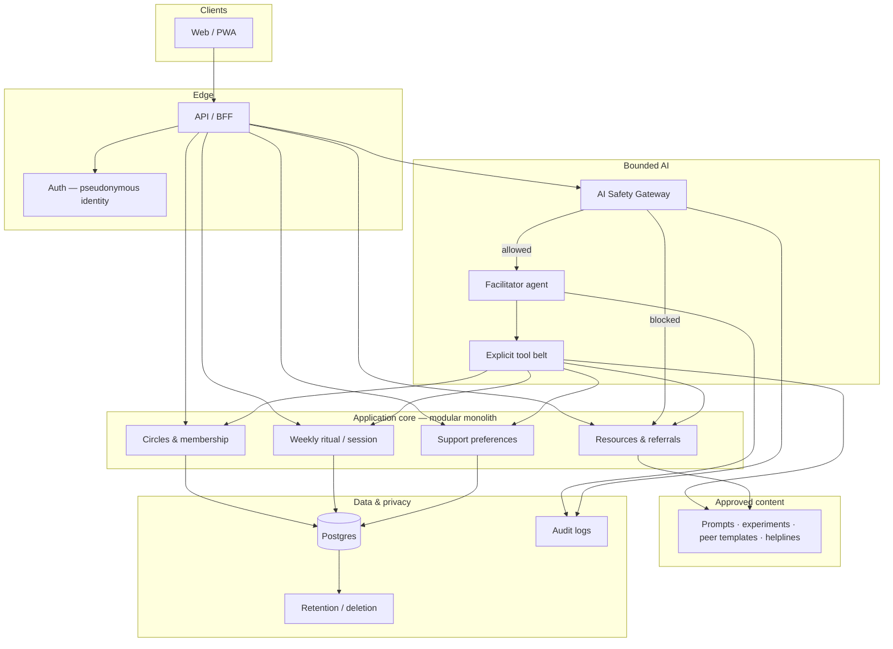

# Small Circles — System Design

**Audience:** engineers, reviewers, and non-specialists who need a clear picture of *how* the product should be built.  
**Status:** Target architecture + recommended stack. The **current working demo** is the terminal facilitator — see [agentic-cli-demo.md](agentic-cli-demo.md).  
**Vision source:** [README.md](../README.md) (product concept, safety, PDPA, four-week plan).

---

## 1. Purpose of this document

This file answers:

1. What **system shape** fits Small Circles (and what does not)
2. How **architecture** layers fit together (safety, peers, AI, data)
3. What **platform and stack** to choose next after the CLI demo
4. How today’s CLI maps to the future product

It does **not** replace the product vision in the README. It implements that vision as engineering guidance.

---

## 2. Design north star

> **The human community is the product. The AI is infrastructure that helps the community function safely.**

Supporting principles (from the README):

| Principle | System implication |
|---|---|
| Support, don’t treat | No diagnosis, medication advice, or “AI therapist” role |
| Facilitate, don’t diagnose | Facilitator guides stages; content comes from approved libraries |
| Connect, don’t create dependency | Time-bounded circles/rituals; no engagement feed or rankings |
| Peer support first | Real humans reply in production; AI may *suggest* wording only |

CBT-informed facilitation (noticing, gentle perspective-taking, optional small actions) is delivered via **approved libraries**, informed by research summarised in [cbt-informed-research.md](cbt-informed-research.md).

---

## 3. Architecture overview

### 3.1 Target system (product)



**Plain reading**

1. Users use a **web / PWA** client.
2. Requests hit an **API** with **pseudonymous auth**.
3. Domain features (circles, ritual, preferences, resources) live in one **modular monolith**.
4. Anything involving the facilitator goes through the **Safety Gateway** first.
5. The facilitator may only act through an **explicit tool belt**.
6. Interventions and helplines come only from an **approved content** store.
7. **Postgres** holds user/circle/ritual data; **audit** and **retention** sit beside it.

This matches the README “Final System Architecture” idea (Peer Support · AI Facilitator · Moderation · Privacy Layer) with more engineering detail: [README §38](../README.md#38-final-system-architecture).

### 3.2 Current demo (CLI)

The CLI already implements the **inner loop** of this design:

```text
You → cli.py → agent.py → crisis.py (gateway)
                    ↓
              tools.py (tool belt)
                    ↓
         approved JSON libraries + session.json
```

Full plain-language diagram and file map: [agentic-cli-demo.md](agentic-cli-demo.md).

| Target concept | CLI today |
|---|---|
| Client | Terminal ([`src/cli.py`](../src/cli.py)) |
| Safety Gateway | [`src/crisis.py`](../src/crisis.py) |
| Facilitator | [`src/agent.py`](../src/agent.py) (OpenAI or mock) |
| Tool belt | [`src/tools.py`](../src/tools.py) |
| Approved content | [`data/interventions/cbt_informed.json`](../data/interventions/cbt_informed.json), [`data/templates.json`](../data/templates.json), [`data/resources.json`](../data/resources.json) |
| Circles | Topic join + **demo** stand-in members (not live humans) |
| Persistence | [`data/session.json`](../data/session.json) via [`src/storage.py`](../src/storage.py) |

---

## 4. Architectural style: safety-first modular monolith

### 4.1 Why this style

| Need | Choice |
|---|---|
| Small team / four-week realism | **One deployable backend**, clear packages — not microservices day one |
| Auditable AI | Gateway + tools + libraries are easy to test and reason about |
| Peer ritual product | Domain modules map to journey stages, not to a social feed |
| Singapore / PDPA story | Fewer moving parts; clearer data inventory |

### 4.2 Suggested backend packages

| Module | Responsibility |
|---|---|
| `identity` | Pseudonymous accounts, session auth |
| `circles` | Topics, membership (4–6), norms |
| `ritual` | Check-in, prompts, posts, experiments, closure |
| `preferences` | Support preference model + banners |
| `content` | Versioned approved libraries |
| `safety` | Classification, refuse/redirect/escalate |
| `facilitator` | Agent + tool schemas + orchestration |
| `moderation` | Report/block/queue (product stage) |
| `privacy` | Retention, deletion, export |

Keep the **CLI** as a thin client over `safety` + `facilitator` + `content` + `ritual` for demos and regression evals ([`scripts/eval_cbt_informed.py`](../scripts/eval_cbt_informed.py)).

### 4.3 What to avoid

- Open-ended “chat with the model about your mental health” as the core product
- Early microservices, event buses, or vector-DB-everything RAG for a small curated library
- Engagement feeds, follower graphs, leaderboards
- Native-only mobile as the first client

---

## 5. Recommended platform and stack

### 5.1 Platform (what users use)

| Priority | Recommendation | Rationale |
|---|---|---|
| **1** | **Responsive web app** | Fastest path to circles, ritual UI, moderation |
| **2** | **PWA** (same codebase) | Installable on phones without two native apps |
| **Later** | Native iOS/Android | Only if push/offline become hard requirements |

**Primary audience:** adults in Singapore, mobile + desktop browsers.  
**CLI:** remains a **demo / eval harness**, not the end-user product.

Prefer **stage-based screens** (check-in → prompt → share → experiment → summary) over an infinite chat transcript as the only UX.

### 5.2 Default stack (next build after CLI)

```text
Web (Next.js or React + Vite)
        │
FastAPI (Python)     ← reuse agent / tools / crisis concepts
        │
Postgres
        │
OpenAI API (tool calling) + approved content store
```

| Layer | Recommendation | Notes |
|---|---|---|
| Backend language | **Python** | Reuse facilitator, tools, safety, libraries |
| API framework | **FastAPI** | Clear routes, OpenAPI, easy SDET |
| Database | **Postgres** | Circles, posts, prefs, audit; relational fit |
| Cache / limits | Redis (optional later) | Rate limits — not required on day one |
| Frontend | **Next.js** or **React + Vite** | Forms + ritual stages |
| AI provider | **OpenAI** (or equivalent) via official SDK | Tool calling only for interventions |
| Content | DB tables and/or versioned JSON | Promote today’s files into editable content |
| Auth | Magic link / OAuth + **pseudonymous display name** | No real-name requirement in product UX |
| Hosting | Region near Singapore (e.g. `ap-southeast-1`) | Latency + residency narrative |
| Secrets | Env / secret manager | Never commit API keys (see [`.env.example`](../.env.example)) |

### 5.3 Stack choices that usually do *not* fit early

| Avoid early | Why |
|---|---|
| Full rewrite in Node “to match frontend” | Python facilitator is already an asset |
| LangChain/LangGraph as mandatory core | Add only if orchestration becomes painful |
| Vector search as the main content system | Library is small and curated |
| WebSockets-everywhere | Weekly ritual is mostly async posts + notifications |
| Heavy multi-region active-active | Premature for MVP |

---

## 6. Core runtime flows

### 6.1 Message / action path (always)

```text
User action
  → AuthN / AuthZ
  → AI Safety Gateway
       ├─ crisis / diagnosis / medication → refuse + approved resources (+ escalate policy)
       └─ allow → Facilitator
                    → Tool calls only
                    → Persist ritual state
                    → Reply (short, bounded)
```

Gateway behaviour and product rules: README sections on AI Safety Gateway, refuse/redirect/escalate, and AI system requirements ([AI-01…AI-09](../README.md#40-key-system-requirements-for-the-agentic-ai)).

### 6.2 Weekly ritual state machine

```text
Onboard / join topic
  → Preferences
  → Check-in
  → Guided prompt(s)     ← CBT-informed sequence
  → Share + peer replies ← humans in product; demo templates in CLI
  → Optional experiment
  → Support map / close
  → (next open) experiment review if accepted
```

CLI already exercises this path; product adds multi-user posts and real peer replies.

### 6.3 Content rules

| Allowed | Forbidden |
|---|---|
| Retrieve prompt/experiment by id from approved library | Invent clinical worksheets or hotlines |
| Suggest peer-reply **templates** for humans to send | Pretend AI peers are real members |
| Show approved Singapore resources | Diagnose, prescribe, claim therapist identity |

---

## 7. Data design (guidance)

### 7.1 Minimise

Store only what the ritual and safety need. Prefer:

- Pseudonymous user id + display name  
- Topic / circle membership  
- Preference keys  
- Check-in scores + short notes  
- Reflection / post text the user chose to share  
- Experiment id + accept/skip/review  
- Safety/audit events  

Avoid by default: precise location, contacts scrape, social graph outside the circle, unnecessary biometrics.

### 7.2 Logical entities

```text
User ──< Membership >── Circle ── Topic
  │                       │
  ├── Preference
  ├── RitualSession
  │      ├── CheckIn
  │      ├── Reflection
  │      ├── Post ──< Reply (human)
  │      └── ExperimentChoice
  └── SafetyEvent / AuditEvent

ContentItem (prompt | experiment | template | resource)
```

CLI maps Session + JSON files onto a subset of this model ([`src/models.py`](../src/models.py)).

### 7.3 LLM provider data

- Send the minimum needed for the current turn (stage, tool results, short user text).
- Do not send other members’ private check-ins to the model without a clear, authorized need.
- Document provider region and retention in the privacy notice when you ship a hosted product.

---

## 8. Safety, moderation, and privacy layers

| Layer | Responsibility |
|---|---|
| **Safety Gateway** | Classify risk; stop normal facilitation when required |
| **Tool authorization** | Facilitator cannot call undeclared tools |
| **Content gate** | Interventions only from approved store |
| **Moderation** (product) | Report, block, human queue |
| **Privacy** | Retention, deletion, access control, encryption in transit/at rest |
| **Evaluation** | Regression suite for crisis/diagnosis/meds/injection/tool misuse |

CLI today: gateway + tools + resources + eval script. Still open: full moderation UI, formal audit store, DPIA, account deletion — see README four-week checklist.

---

## 9. Evolution roadmap

| Stage | System | Goal |
|---|---|---|
| **A — Now** | CLI modular loop + JSON libraries | Prove ritual + safety + CBT-informed content |
| **B — Next** | FastAPI + Postgres + web UI; reuse Python facilitator | Multi-user circles; real posts; templates as *suggestions* |
| **C — Harden** | Moderation queue, audit log, privacy controls, SG-region ops | Closed pilot readiness |
| **D — Scale (only if needed)** | Split read-heavy or notification workers | Avoid premature microservices |

Do not skip Stage B “content + ritual + safety” discipline when adding chat polish.

---

## 10. Non-functional requirements (summary)

| Area | Guidance |
|---|---|
| Security | AuthZ on every circle/post; rate limits; secret management |
| Reliability | Fail safe: if AI/provider fails, keep ritual usable with library-only fallback (CLI mock pattern) |
| Observability | Structured logs for tool calls and safety decisions; metrics from README AI evaluation list |
| Accessibility | Calm UI, readable typography, clear non-therapy labeling |
| Compliance | PDPA-minded inventory; Singapore helplines in approved resources |

---

## 11. Related documents

| Document | Role |
|---|---|
| [README.md](../README.md) | Product vision, safety policy, MVP & four-week plan, final architecture sketch |
| [agentic-cli-demo.md](agentic-cli-demo.md) | Current demo architecture, file map, how to run |
| [cbt-informed-research.md](cbt-informed-research.md) | Research basis for facilitation content |
| [data/research/README.md](../data/research/README.md) | Literature search outputs |

---

## 12. Decision record (defaults)

Unless product constraints change, prefer:

1. **Modular monolith** over microservices  
2. **Web/PWA** over native-first  
3. **Python + FastAPI + Postgres** over a full stack rewrite  
4. **Tool-calling facilitator + approved libraries** over open therapy chat  
5. **Safety Gateway before AI** on every consequential path  
6. **Humans in circles** in production; demo templates only until then  

These decisions keep Small Circles aligned with peer-support ethics, Singapore safety expectations, and a buildable path from today’s CLI to a hosted product.
